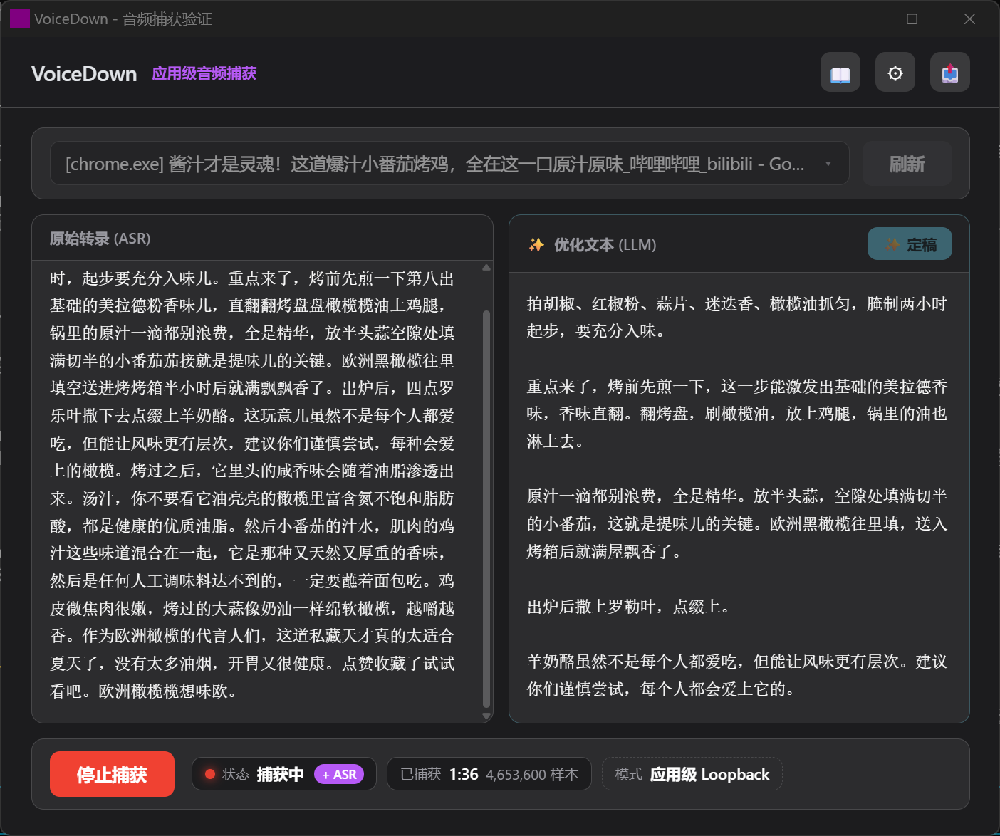

# VoiceDown

> **Process-level WASAPI loopback audio capture + streaming Chinese ASR for Windows.**
> Pick a target window, record only that process's audio, and transcribe it to text in real time.

[](LICENSE)
[](https://tauri.app)
[](https://www.rust-lang.org)
[](https://www.python.org)
[](https://learn.microsoft.com/windows/win32/coreaudio/application-loopback-audio-rendering)
[](https://github.com/modelscope/FunASR)

Windows 桌面应用（Tauri 2 + Rust + React）：选定目标窗口 → WASAPI **进程级** Loopback 捕获该进程及其子进程树的音频 → **paraformer-zh-streaming** 流式 ASR 实时转文字 → 保存 WAV + TXT。

**核心差异**：只录目标应用的音频，不影响系统其他声音。市面上多数中文 ASR 工具录的是系统混音或麦克风，VoiceDown 通过 WASAPI Process Loopback 做到了**进程级**隔离——开会、看直播、听播客时，只转你想转的那个应用。



## ✨ 特性

### 🎯 进程级捕获
- **WASAPI Process Loopback**：仅捕获目标进程及其子进程树音频，不录系统其他声音
- EnumWindows 枚举所有可见窗口，下拉选择目标
- 48kHz f32 stereo → 16-bit PCM mono WAV 存档

### 🎙️ 实时流式 ASR
- **paraformer-zh-streaming** 真增量流式识别（600ms/chunk，cache 跨块复用，连续长语音末段不丢）
- **ct-punc 标点模型懒加载**：启动仅加载 paraformer 即就绪（~15s），标点模型后台加载不阻塞 UI
- **ASR 崩溃自愈监管**：Python 子进程异常自动重启，会话不中断
- 启动即预加载模型，「开始捕获」即用，不丢前期音频
- 繁→简自动转换（OpenCC）+ 用户词典最长匹配替换

### ✍️ LLM 文本优化（两阶段）
- **实时草稿**：捕获时增量分批优化（字数/句数/时间任一阈值触发），独立线程不阻塞实时字幕
- **离线定稿**：停止后手动触发整篇结构化优化
- 后端可切换：**Ollama 本地** / **OpenAI 兼容云端**（默认 DeepSeek）
- 轻度（纠错 + 标点 + 语气词）/ 深度（+ 分段润色）两档 prompt
- **降级铁律**：单批 LLM 失败用原始文本回退，永不丢原文、永不阻塞停止

### 💾 可配置导出
- 导出开关 + 格式（`txt` / `md`）+ 自定义导出目录
- **停止异步化**：导出在后台收尾线程完成，UI 不卡顿
- 产物：WAV + 原始 TXT + 优化 TXT（按配置）

### 🎨 界面
- Apple 风格深色主题，磨砂玻璃 toolbar（`backdrop-filter: blur + saturate`）
- 双栏对比布局：左「实时字幕」| 右「优化文本」（未开启优化时退化为单栏）
- 状态点（idle 绿 / capturing 红脉动 / stopping 橙）+ ASR 就绪徽章

## 🚀 快速开始

### 前置依赖

| 依赖 | 说明 |
|------|------|
| Rust (stable) | 编译 Tauri 后端 |
| Node.js 18+ | 前端构建 |
| Python 3.12 | ASR 引擎（全局安装） |

> **首次运行需下载模型 ~2GB**（paraformer-streaming ~848MB + ct-punc ~1.1GB，从 ModelScope 下载，缓存后免重复下载）。

### 1. 安装 Python ASR 依赖

```powershell
pip install -r src-tauri/python_asr/requirements.txt

# 验证流式 API（首跑下载模型 ~90s，缓存命中 ~10s）
cd src-tauri/python_asr
python verify_api.py test.wav
```

依赖锁定：`funasr>=1.3.13,<1.4` + `torch==2.3.1` + `torchaudio` + `librosa` + `soundfile` + `modelscope`。

### 2. 启动应用

```powershell
# 默认带 ASR（asr 已为默认 feature）
npx tauri dev

# 或仅音频捕获（无 ASR，无需 Python 环境）
npx tauri dev --no-default-features --features custom-protocol
```

### 3. 使用流程

1. 启动后 ASR 模型后台预加载（~15s 就绪，「开始」按钮加载中禁用）
2. 下拉选择目标窗口
3. 点「开始捕获」→ 实时字幕逐句显示
4. （可选）开启「优化文本」→ 右栏实时显示 LLM 优化结果
5. 点「停止」→ 自动保存到 `%USERPROFILE%\Documents\VoiceDown\`（`capture_<timestamp>.wav` + `.txt`）

## 🏗️ 架构

两个进程，通过 stdio JSON lines 通信：

```mermaid
flowchart LR
    W["目标窗口<br/>(PID)"] --> AC["audio_capture.rs<br/>WASAPI Process Loopback<br/>48k f32 mono"]
    AC -->|"300ms 块"| CH[("crossbeam channel")]
    CH --> FB["feed 子线程<br/>bridge.feed_audio"]
    FB --> PY["Python asr_server.py<br/>librosa 48k→16k<br/>StreamBuffer 攒 600ms 块"]
    PY -->|"paraformer-zh-streaming<br/>增量识别"| RES["stdout JSON lines"]
    RES --> BR["python_bridge.rs<br/>stdout 读取线程"]
    BR --> MT["主线程<br/>t2s + 词典<br/>emit 实时字幕"]
    MT -.->|"旁路 channel"| OPT["优化线程<br/>OptimizerBuffer 攒批"]
    OPT -.->|"emit 优化文本"| UI(["React WebView<br/>双栏显示"])
    MT --> UI
```



- **Rust 主进程**（Tauri）：WASAPI 捕获 + IPC 命令 + ASR 三线程编排（feed 子线程 / 主线程收 result / punc 线程）+ React WebView
- **Python 子进程**（`asr_server.py`）：模型加载 + StreamBuffer 攒块 + ParaformerStreaming 流式识别

**实时性关键**：feed 子线程独占音频管道写入，主线程独占 result 消费——音频管道阻塞不会饿死字幕推送，故字幕始终实时。

## ⚠️ 已知限制

VoiceDown 的捕获粒度是 **WASAPI Process Loopback**，这些是架构固有限制（非 bug，无法在当前架构内解决）：

- **🌐 浏览器多窗口串音**：Chrome / Firefox 所有窗口和标签页共享同一个浏览器进程。选任一浏览器窗口，都会录到该实例**全部窗口/标签页**的音频混音。前端已用「应用级音频捕获」徽标如实标注。
- **🪟 UWP 应用暂不支持**：Media Player 等 `ApplicationFrameHost` 托管的窗口无法捕获。
- **📦 应用级而非窗口级**：WASAPI Process Loopback 的粒度是进程(PID) + 进程树，没有窗口或标签页维度。

## 📂 项目结构

```
voicedown/
├── src/                          # 前端 (React + TypeScript)
│   ├── App.tsx                   # 主界面（组合）
│   ├── types.ts                  # 共享类型定义
│   ├── components/               # WindowDropdown / SettingsModal / DictionaryModal / ExportSettingsModal
│   └── hooks/                    # useAsrState / useTranscriptionStreams / useCaptureLifecycle
├── src-tauri/
│   ├── python_asr/               # Python ASR 服务
│   │   ├── asr_server.py         # paraformer-zh-streaming 流式 stdio 服务 + StreamBuffer
│   │   ├── verify_api.py         # 流式 API 冒烟测试
│   │   ├── requirements.txt      # Python 依赖（torch 2.3.1 锁版本）
│   │   └── tests/                # StreamBuffer 攒块单测
│   └── src/
│       ├── lib.rs                # IPC 命令 + ASR/优化线程编排
│       ├── audio_capture.rs      # WASAPI Process Loopback + 300ms 分块
│       ├── python_bridge.rs      # Python 子进程生命周期 + 流式协议
│       ├── asr_supervisor.rs     # ASR 崩溃自愈监管器
│       ├── asr_session.rs        # ASR 会话三线程编排
│       ├── text_optimizer.rs     # LLM 文本优化 (Ollama/OpenAI) + 攒批
│       ├── text_postprocess.rs   # 繁→简 + 词典替换
│       ├── dsp.rs / wav_render.rs / time_util.rs
│       ├── capture_finalizer.rs / export_config.rs
│       └── window_selector.rs    # EnumWindows 窗口枚举
├── package.json
├── vite.config.ts
└── src-tauri/tauri.conf.json
```

## 🛠️ 技术栈

| 层 | 技术 |
|----|------|
| Frontend | React 18 + TypeScript 5 + Vite |
| Desktop | Tauri 2.x |
| Audio | Rust + wasapi crate（WASAPI Process Loopback） |
| ASR | Python 3.12 + funasr（paraformer-zh-streaming 真流式） |
| Punctuation | ct-punc（懒加载） |
| LLM 优化 | Ollama / OpenAI 兼容（reqwest + rustls-tls） |
| Window Enum | Rust + windows crate（EnumWindows + Kernel32） |

## 🔧 开发

```powershell
# Rust 检查 / 测试（asr 已为默认 feature，自动启用）
cargo check --manifest-path src-tauri/Cargo.toml
cargo test  --manifest-path src-tauri/Cargo.toml

# 前端类型检查
npx tsc --noEmit

# Python 单测（StreamBuffer 攒块）
cd src-tauri/python_asr && python -m pytest tests/test_stream_buffer.py -v
```

## 📄 License

[MIT License](LICENSE) © 2026 T2lighter
